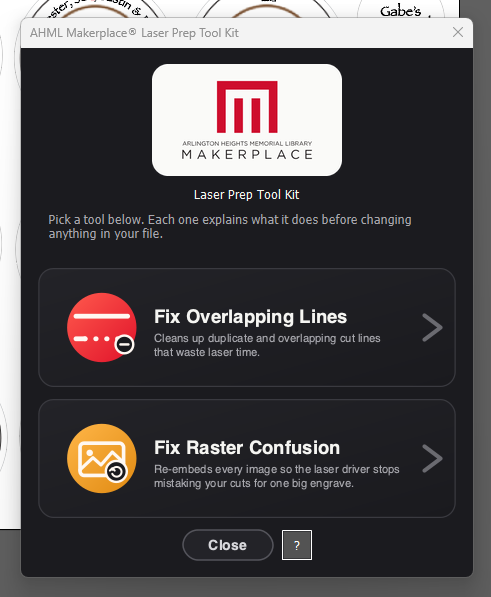
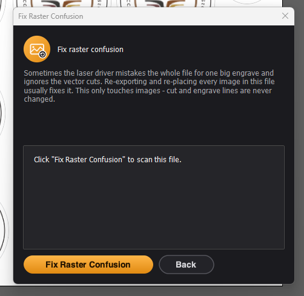
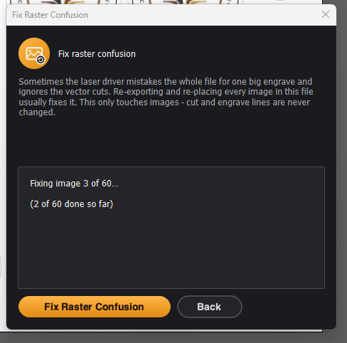
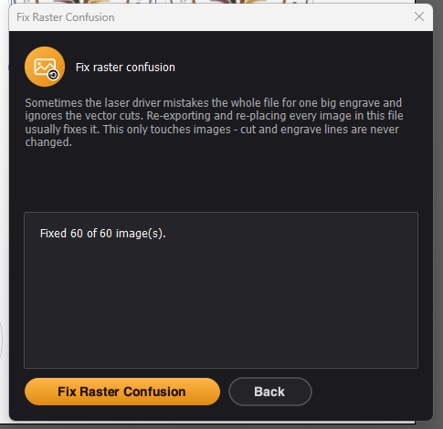
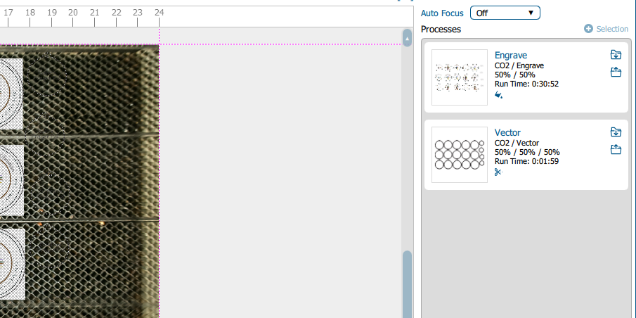

# AHML Makerplace® Laser Prep Tool Kit

An Adobe Illustrator toolkit that catches the two most common ways a
laser-cutting file goes wrong before you send it to the Epilog: wasted
double-cuts from overlapping lines, and a raster image confusing the
driver into engraving the whole job. Built for the [Arlington Heights
Memorial Library](https://ahml.info)'s MakerPlace, and free for any other
library or makerspace to use.

Run it, pick a tool from the main menu, and it explains what it does
before changing anything. Every change is a normal Illustrator edit -
**Cmd+Z** undoes it like anything else.

The `.jsx` file is fully self-contained - the menu and dialogs are
custom-themed (the real AHML MakerPlace logo, colored icon buttons) using
images embedded directly in the script, so there's no separate folder to
keep track of. Copy just the one `.jsx` file anywhere and it works. The
source PNGs and the logo SVG live in [`assets/`](assets) for reference if
the artwork ever needs to change, but nothing at runtime reads that
folder.

## Contents

- [The tools](#the-tools)
  - [Fix Overlapping Lines](#fix-overlapping-lines)
  - [Fix Raster Confusion](#fix-raster-confusion)
- [Install](#install)
- [Use](#use)
- [Status](#status)
- [Repository layout](#repository-layout)
- [License](#license)

## The tools

### Fix Overlapping Lines

Finds two kinds of wasted laser time and lets you review before removing
anything:

1. **Duplicate/overlapping cut lines** - the same cut line traced twice (or
   two lines that partly overlap) means the laser cuts that stretch of
   material more than once.
2. **A line getting engraved where a cut will happen** - a heavier-weight
   stroke sitting on top of a cut line means the laser wastes an engrave
   pass on material that's about to be cut away.

It only ever looks at **stroked lines**. Fills, raster images, and placed
art are never touched by this tool, no matter how much they overlap
anything - that kind of overlap is normal and expected.

**Cut vs. engrave:** Epilog identifies a vector cut line by stroke
**weight**, not color: a hairline stroke (~0.001in) means "cut this." A
heavier stroke gets engraved. This tool uses that same rule and never
looks at stroke color.

**What it does and doesn't fix automatically:**
- **Exact duplicate cut lines** - removed.
- **Cut lines fully covered by another cut line** - removed. Removing
  either of these never changes the physical cut - the laser still
  traces the same path once instead of twice.
- **Two cut lines that partly overlap** (each has some shared length, but
  also unique length of its own) - the shorter of the pair is
  **automatically shortened** to just its unique, non-overlapping
  stretch, as long as both lines are simple, straight, 2-point paths -
  the ordinary case for laser-cut line art. This eliminates the
  double-cut entirely: the shared stretch only gets traced once, by the
  longer line. If either line is a multi-point polyline, a curve, or a
  closed path, it's left selected for manual review instead - safely
  deciding which interior points to keep isn't automated.
- **Two cut lines that touch end-to-end with no gap and no overlap** -
  **joined into one continuous path**, as long as both are simple,
  straight, 2-point lines. This produces the exact same physical cut,
  just as a single stroke instead of two that happen to meet at a point -
  avoids a stop-and-restart mark right at the seam. Handles chains of
  more than two touching lines too, not just pairs. This often kicks in
  naturally right after a trim above: a partial overlap gets shortened,
  and the shortened line now touches its neighbor exactly at the trim
  point, so the two get joined into one clean path instead of staying as
  two lines that happen to meet.
- **Engrave lines that overlap a cut line, fully or partly** - never
  auto-removed or auto-shortened, only selected and reported for you to
  review. Unlike a redundant cut line, changing an engrave line changes
  what actually gets marked on the material - and the overlap check has
  real edge cases (coincidence tolerance, curves aren't checked for
  partial overlap at all), so a wrong automatic edit here would silently
  destroy artwork instead of just costing a few seconds of manual
  cleanup. A human makes the call every time.
- Curved paths (beziers) are only checked for exact whole-path duplicates -
  the overlap math only decomposes straight-line segments.
- Fills, raster images, and placed art are completely out of scope for
  this tool - never scanned, never flagged, never touched.

### Fix Raster Confusion

Sometimes - not always, cause unknown - a raster image in the file
confuses the Epilog driver into reading the **entire job as one big
engrave**, ignoring the vector cuts completely. The known fix, found by
trial and error, is to re-export every raster image to a fresh file and
re-place it in the exact same spot. This tool automates exactly that.

- Scans for every image in the file - both embedded and linked/placed
  (any common raster format: PNG, JPEG, TIFF, GIF, BMP, PSD, WEBP).
  Linked *vector* files (AI/EPS/PDF placed as artwork) are left alone.
- For each image found: temporarily hides everything else in the
  document so overlapping cut lines or other artwork can't bleed into
  the re-captured pixels, renders just that image's own content to a
  fresh PNG, deletes the original, and places the new PNG back in the
  exact same spot - same position, size, layer, and group - then embeds
  it. Rotated or skewed images are handled correctly too - the capture
  bakes in whatever's visually rendered at that spot, so the replacement
  doesn't need to reapply any transform to look identical.
- Cut and engrave lines are never touched by this tool.
- Runs on every image it finds automatically - no per-image picker.
  There's one confirmation before it starts, and a running "Fixing image
  N of M" status while it works.

  
  
  

**A note on confidence:** this fix's *mechanics* (isolating and
re-capturing each image's pixels, severing the link, restoring position,
size, layer, and group placement) have been run and re-verified against
real multi-layer, multi-group Illustrator files - not just synthetic
test cases. What hasn't been verified - can't be, outside a real Epilog
send - is whether it always resolves the actual driver confusion. It
faithfully reproduces the known manual workaround; if a file still
misbehaves after running it, that's worth reporting back.

*The Epilog job manager after running the fix, correctly split into a
separate Engrave and Vector process instead of one big engrave.*

## Install

**Mac:**
- **Icon (recommended for a shared station):** double-click
  [`AHML Laser Prep Tool Kit.app`](AHML%20Laser%20Prep%20Tool%20Kit.app).
  It brings Illustrator to the front (launching it if needed) and opens
  the tool kit on whatever document is open. Keep it next to the `.jsx`
  file - it finds the script next to itself, so the two can be copied
  anywhere together and keep working.
- **No install:** File > Scripts > Other Script... and pick
  `AHML Makerplace Laser Prep Tool Kit.jsx` directly. Do this every time.
- **Installed into Illustrator:** copy the `.jsx` file into Illustrator's
  Scripts folder, e.g.
  `/Applications/Adobe Illustrator [version]/Presets/en_US/Scripts/`, then
  restart Illustrator. It'll show up under
  File > Scripts > AHML Makerplace Laser Prep Tool Kit.

**Windows:**
- **No install:** File > Scripts > Other Script... and pick
  `AHML Makerplace Laser Prep Tool Kit.jsx` directly.
- **Installed into Illustrator:** copy the `.jsx` file into Illustrator's
  Scripts folder, e.g.
  `C:\Program Files\Adobe\Adobe Illustrator [version]\Presets\en_US\Scripts\`,
  then restart Illustrator.
- **Icon (recommended for a shared station):**
  [`AHML Laser Prep Tool Kit.vbs`](AHML%20Laser%20Prep%20Tool%20Kit.vbs)
  is the double-click launcher - keep it next to the `.jsx` file, same as
  the Mac app. A `.vbs` file on its own shows a generic script icon in
  Explorer, so to get a proper custom-icon desktop shortcut, set one up
  once per machine:
  1. Right-click the Desktop > New > Shortcut.
  2. Browse to `AHML Laser Prep Tool Kit.vbs`, or point it at
     `wscript.exe //nologo "<full path to the .vbs>"` if you want it to
     run with no console flash.
  3. Right-click the new shortcut > Properties > Change Icon... > Browse,
     and pick `AppIcon.ico` (included in this repo).
  4. Rename the shortcut to whatever's clearest for your station.

  A pre-built `.lnk` shortcut isn't included, because Windows shortcuts
  bake in an absolute path - one built here wouldn't point anywhere
  useful once copied to a library's actual machine. The manual steps
  above are a one-time, per-station setup.

  **Verified:** `AHML Laser Prep Tool Kit.vbs` has been run against a
  real Windows copy of Illustrator and works as expected. If it doesn't
  work on your machine, the `.jsx` file itself is completely unaffected
  and works the normal way (File > Scripts > Other Script...). Please
  [open an issue](../../issues) with what happens (including any error
  text) so it can be fixed.

## Use

1. Open the file you're about to cut.
2. Run the tool kit (icon or Scripts menu). Pick a tool from the main
   menu - each explains what it does and asks before making any change.
3. For **Fix Overlapping Lines**: click **Check My File**, review what it
   found (everything gets selected on the canvas), then click **Fix It**.
4. For **Fix Raster Confusion**: click **Fix Raster Confusion**, confirm,
   done.

## Status

Both tools have been run and verified working as expected on **macOS and
Windows**, on **Illustrator 2026**.

**Fix Overlapping Lines** has been run and re-verified against real
Illustrator files, including every documented case above (exact
duplicates, fully-covered lines, partial overlaps on both cut and engrave
lines).

**Fix Raster Confusion**'s Illustrator-side mechanics (image isolation,
capture, re-embed, and restoring position/size/layer/group placement)
have been run and re-verified against real multi-layer, multi-group
files, including catching a couple of real bugs along the way (images
nested inside a group losing that grouping, and a group being hidden out
from under its own contents during capture) that only showed up on actual
production-shaped files, not synthetic test cases. Whether it resolves
the actual Epilog driver confusion can't be tested outside a real send to
the laser.

**The Windows launcher (`.vbs`)** has been run against a real Windows
copy of Illustrator and works as expected. The `.jsx` file itself is
identical on both platforms; only the launcher differs.

Try any of this on a duplicate of a real file first, not the only copy,
and report back anything that looks off.

## Repository layout

| File | Purpose |
| --- | --- |
| `AHML Makerplace Laser Prep Tool Kit.jsx` | The tool itself - fully self-contained, this is the only file Illustrator actually runs. |
| `AHML Laser Prep Tool Kit.app` | Mac double-click launcher. |
| `AHML Laser Prep Tool Kit.applescript` | Source for the Mac launcher, in case it ever needs to be rebuilt. |
| `AHML Laser Prep Tool Kit.vbs` | Windows double-click launcher. |
| `AppIcon.icns` / `AppIcon.ico` | Launcher icons for Mac / Windows. |
| `assets/` | Source PNGs and the logo SVG the `.jsx`'s embedded UI images were generated from - only needed if you're editing the artwork. |
| `screenshots/` | Images used in this README. |
| `LICENSE` | MIT license text. |

## License

MIT - see [LICENSE](LICENSE). Free to use and modify, including at other
libraries or makerspaces; please keep attribution back to this project.
The same text is summarized in the tool's own **?** button on the main
menu, along with the current version number.
